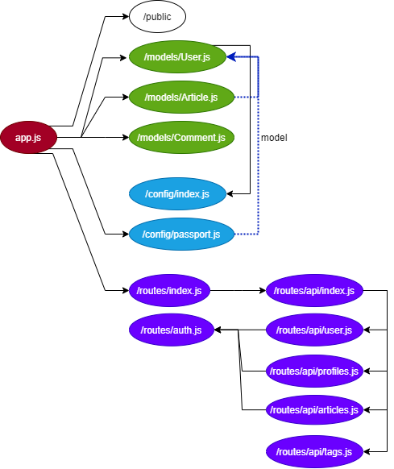

# node-express-reralworld-example-app

## Purpose

* node.js (express) でのRestAPIの構成を知る

* mangooseの使い方をつかむ

* 認証系の使い方をつかむ

* そのほかに使われている技術を知る

  

## Overview

project : https://github.com/gothinkster/node-express-realworld-example-app  
langage : JavaScript  

1. 構造
1. ファイル詳解


## 1. 構造

### 1.1 ディレクトリ構造

```
/node-express-realworld-example-app
├── /.circleci
|   └── config.yml        <= circleci設定ファイル
├── /config               <= 設定プログラム群
├── /models               <= モデルプログラム群
├── /public               <= 静的ファイル
├── /routes               <= ルーティング群  
├── /tests                <= テスト
├── .gitignore         
├── .travis.yml           <= travisCIの設定ファイル  
├── README.md        
├── app.js   　　　　　　　　<= エントリーポイント
├── package.json      
├── project-logo.png  
└── yarn.lock   
```

### 1.2 プログラム依存関係




## 2. ファイル詳解

### 2-1. 依存ファイル

- [expressjs](https://github.com/expressjs/express) - HTTP リクエストを処理・ルーティングするためのサーバ
- [express-jwt](https://github.com/auth0/express-jwt) - JWTを認証用に検証するためのミドルウェア
- [jsonwebtoken](https://github.com/auth0/node-jsonwebtoken) - 認証で使用する JWT を生成するためのものです。
- [mongoose](https://github.com/Automattic/mongoose) - MongoDBのデータをjavascriptにモデリングしてマッピングするためのもの
- [mongoose-unique-validator](https://github.com/blakehaswell/mongoose-unique-validator) - Mongoose でユニークな検証エラーを処理するためのもの。Mongoose はドキュメントレベルでしかバリデーションを処理しないので、コレクション全体でユニークなインデックスを使用するとドライバレベルで例外が発生します。
- [passport](https://github.com/jaredhanson/passport) - ユーザ認証を扱うためのもの
- [slug](https://github.com/dodo/node-slug) - タイトルを URL フレンドリーな形式にエンコードするためのもの。


### 2-2. プログラム

#### app.js

アプリケーションへのエントリポイント

Expressサーバーを定義し、mongooseを使用してMongoDBに接続する

#### /public

クライアントに供給する一般的なアセットに応じた構成 (images, css, jsなど)

404.html, 500.htmlなどを用意しエラー時の出力などを行う。

※ .keep ファイルはgit出からディレクトリを管理対象に含めるために作成

#### /model

mongooseモデルのスキーマ（Javaのクラスみたいなもの）を定義

#### /config

pasportの構成と、構成/環境変数を定義

#### /routes

APIのルート定義


### 2-2. 設定ファイル

#### 2-x. circleci[^※1]

**TODO** : https://qiita.com/gold-kou/items/4c7e62434af455e977c2

​	`.circleci/config.yml`に記載する。

[^※1]:https://circleci.com/docs/ja/2.0/getting-started/


## 3. 認証関連

### 3-1. 構成

./models/User.js

* passwordはcroptoを使用して暗号化＋ハッシュ化してDBに保管する(setPasword())
  * 暗号化はsha512で行っている（検討事項）
* 認証トークンの発行、配布の定義もここでしている (geterateJWT(), toAuthJSON())


### 3-2. まとめ

* トークン規格はJWTが一般的
* passwordはそのままDBで管理せず暗号＋ハッシュ化しなくてはいけない


