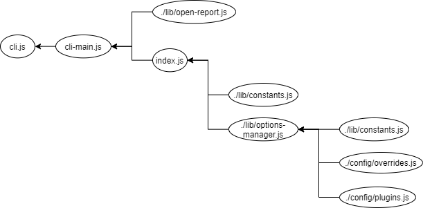

# xojs/xo

## Purpose

* 小さなプロジェクトの構成の理解する
* 各ファイルの粒度を理解する

  

## Overview

project : https://github.com/xojs/xo
langage : JavaScript

1. 構造
1. ファイル詳解


## 1. 構造

### 1.1 ディレクトリ構造

```
/xo
├── /config            <= xoの設定プログラム(options-managerを制御)
├── /lib               <= プログラムを格納
├── /media             <= readmeなどで使う画像などを格納
├── /test              <= テストプログラム
├── .editorconfig      <= editorの設定 **  
├── .gitattributes     <= gitの改行コード設定 **  
├── .gitignore         <= git無視ファイルの設定 **
├── .npmrc             <= npmの設定  
├── .travis.yml        <= travisCIの設定 **  
├── cli-main.js        <= プログラム
├── cli.js             <= プログラム　エントリーポイント
├── code-of-conduct.md <= contributeの規約 **
├── contributing.md    <= contributeの方法 **
├── index.js           <= プログラム
├── license            <= license **
├── package.json       <= binはcli.js
└── readme.md          <= readme **
```

### 1.2 プログラム依存関係



## 2. 設定ファイル詳解

* .editorconfig	https://qiita.com/inabe49/items/d81fed3cf58ad751d915
* .gitattributes  https://qiita.com/nacam403/items/23511637335fc221bba2
* .npmrc            https://neos21.hatenablog.com/entry/2017/08/06/080000
